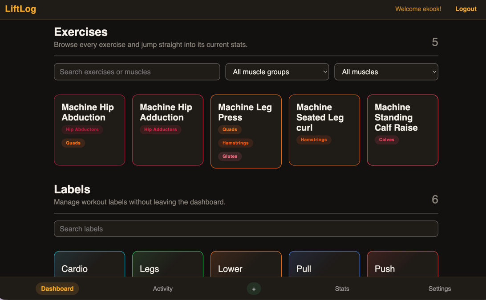
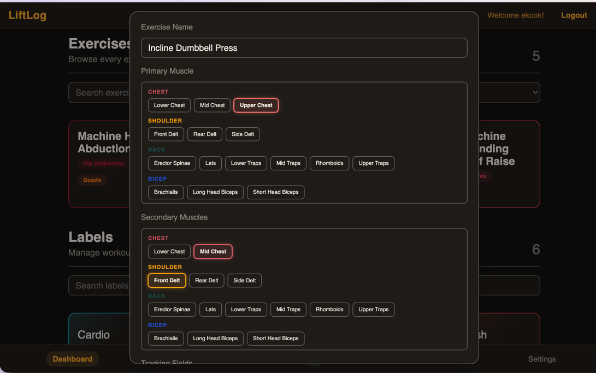
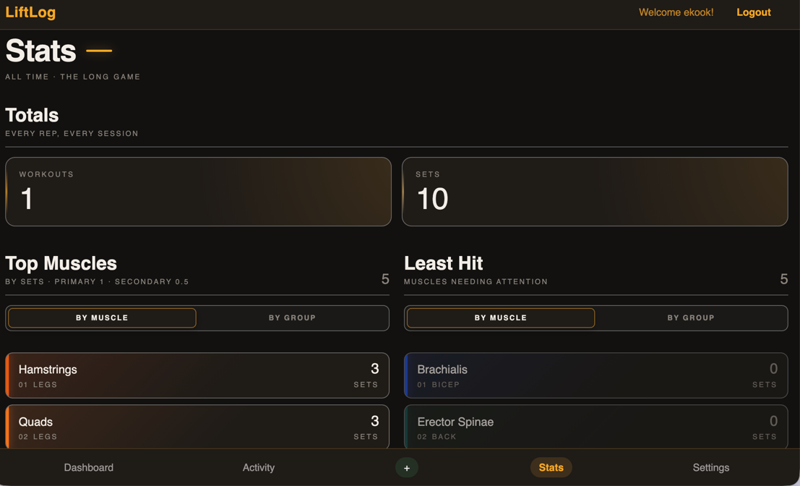
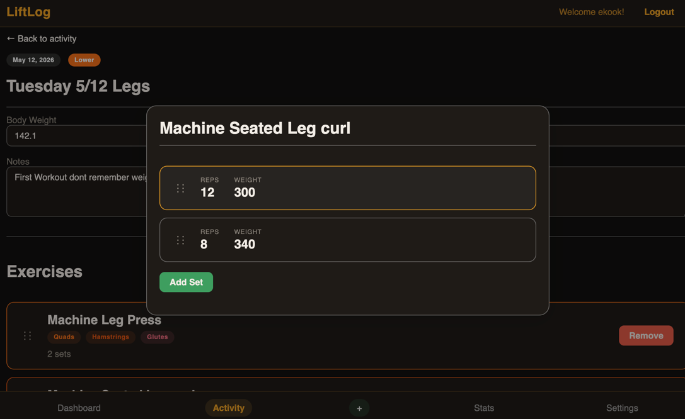

# LiftLog

LiftLog is a full-stack workout tracking application for logging sessions, organizing exercises by muscle group, and turning raw training history into useful performance insights.

It was built as a polished end-to-end product rather than a CRUD demo: authentication, structured workout editing, set-level tracking, drag-and-drop reordering, seeded training metadata, and a stats experience that surfaces muscle, label, and exercise trends from real workout data.

## Product Summary

LiftLog helps a lifter answer three practical questions:

- What did I train recently?
- What exactly happened inside a workout?
- What patterns are showing up across my training volume?

The app is organized around three primary experiences:

- `Dashboard`: browse exercises and workout labels, inspect exercise details, and manage the training catalog.
- `Workout Page`: edit a workout in place, add exercises, log sets, reorder exercises, and update metadata like notes and bodyweight.
- `Stats Page`: review top and bottom trained muscles, muscle groups, labels, and exercises with filters that break trends down by group or muscle.

## Highlights

- Secure login flow with access and refresh token handling.
- Exercise library grouped by primary and secondary muscles.
- Workout labels for split organization like `Push`, `Pull`, `Legs`, `Cardio`, and more.
- Configurable tracking fields for different exercise types such as weight, reps, distance, pace, calories, RPE, and rest time.
- Full workout editing flow with add/remove/update interactions.
- Drag-and-drop exercise ordering inside a workout using Angular CDK.
- Set-level entry management with sortable set sequences.
- Analytics-driven stats page that aggregates volume by muscle and muscle group.
- Seeded domain data for muscles, tracking fields, labels, and an admin user to make local evaluation fast.

## Tech Stack

**Frontend**

- Angular 21
- TypeScript
- Angular Signals
- Angular CDK
- CSS

**Backend**

- NestJS 11
- TypeScript
- Prisma
- PostgreSQL

**Tooling**

- pnpm workspace
- Docker Compose for local Postgres
- ESLint + Prettier

## Screenshots

### Dashboard



The dashboard acts as the control center for the training catalog, with searchable exercises, workout labels, and detail views for editing existing entities.

### Exercise Creation Modal



The exercise creation flow supports primary and secondary muscle assignment plus configurable tracking fields, which makes the data model flexible enough for both strength and conditioning movements.

### Stats Page



The stats page surfaces muscle-volume trends, top and bottom trained areas, and exercise breakdowns that can be filtered by muscle group or specific muscle.

### Workout Page



The workout page is built for active logging: inline workout updates, exercise management, set tracking, and drag-and-drop ordering in a single workflow.

## Architecture

The repo is split into two apps:

- [`frontend`](./frontend): Angular client with route-level pages for login, dashboard, activity, stats, and workout detail.
- [`backend`](./backend): NestJS API with modules for auth, workouts, exercises, workout labels, muscles, tracking fields, personal records, and stats.

Data flows from a PostgreSQL database through Prisma into REST endpoints consumed by the Angular client. The stats experience is backed by server-side aggregation logic, including grouped exercise and muscle-volume rollups.

## Local Setup

### 1. Install dependencies

```bash
pnpm install
```

### 2. Configure environment variables

Copy the provided examples:

```bash
cp .env.example .env
cp backend/.env.example backend/.env
```

Root `.env` configures the local PostgreSQL container. `backend/.env` configures the API, database URL, seeded admin credentials, and JWT secrets.

### 3. Start PostgreSQL

```bash
docker compose up -d
```

### 4. Run Prisma migrations and seed data

```bash
pnpm --dir backend prisma migrate deploy
pnpm --dir backend prisma db seed
```

If you are starting from a fresh local database and want Prisma to create the schema interactively during development, `prisma migrate dev` is also a valid choice.

### 5. Start the backend and frontend

In separate terminals:

```bash
pnpm api
pnpm web
```

Default local URLs:

- Frontend: `http://localhost:4200`
- Backend: `http://localhost:3000`

## Build and Quality Checks

```bash
pnpm --dir backend build
pnpm --dir frontend build
pnpm --dir backend exec eslint "src/**/*.ts"
```

## Seeded Local Credentials

The seeded admin account uses the values from `backend/.env`:

- `ADMIN_USERNAME`
- `ADMIN_PASSWORD`

That keeps local setup simple while still exercising the real authentication flow.

## Why This Project Stands Out

- It solves a concrete product problem instead of stopping at entity management.
- It combines frontend interaction design with backend data modeling and aggregation logic.
- It includes meaningful domain modeling for workouts, muscles, tracking fields, and personal-record logic.
- It demonstrates production-minded concerns like auth, environment configuration, database seeding, validation, and deploy-oriented build behavior.

## Deployment Notes

- In production, the Angular app and Nest API are intended to sit behind the same HTTPS origin.
- The frontend production environment uses relative API requests, so the browser can call the current origin directly.
- Set `FRONTEND_ORIGIN` only if the frontend is hosted on a separate origin from the API.
- The provided Docker Compose setup binds Postgres to `127.0.0.1` by default for safer local development.
